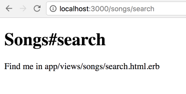
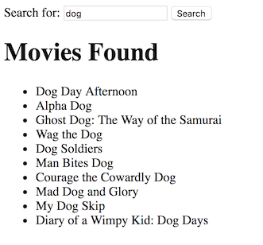

# Let's learn about APIs

## What is an API?
This lesson is to learn about APIs - Application Program Interfaces. APIs allow your product or service to talk to another product or service. They are used to give people access to your data from outside the firewall. This means you are allowing your products data and functionality to be used by other developers.

APIs are used to integrate websites and systems with other websites such as Twitter, Facebook and eBay. An example of an API is Google Maps. By creating a HTML page and adding a few lines of JavaScript, you are able to have a Google map in your application. Once you have integrated a basic map, you can add additional features such as custom markers and popups. All of this can be done without having to download or maintain a large library of code. Instead, Google takes care of maintaining the map so you only need to think about how you want to use it in your application.


If something goes wrong in an API request, an error or a warning will be thrown. Warnings are thrown for non-fatal conditions such as invalid parameters, whereas errors are only thrown for fatal conditions. These warnings and errors are called HTTP status codes. Some common status codes include:


[Click here to see full list of HTTP status codes](https://developer.mozilla.org/en-US/docs/Web/HTTP/Status)


### An API request

Let's look at an example API by the Open Movie Database - [omdbapi.com](omdbapi.com).

There are two main parts to a request for information from the Open Movie Database API:

1. The URL to send all requests to
2. The parameters you include on the end of the URL

Parameters are included in a url after a `?` and are passed in as pairs. A parameter has a key and a value. The keys accepted by the OMDB API are listed on the API instructions page. These are the list of things you can ask the API for information about.

e.g. if you include the parameter key `s` that means you are searching for a title.

The value of the parameter is what you pass in as the search term. For example, if you're looking for movies with 'dog' in the title, you will append the key and value to the end of the url like this:

[http://www.omdbapi.com/?t=dog](http://www.omdbapi.com/?t=dog)

You can include multiple parameters, separating them with `&`

e.g. the OMDB API allows you to request the year of the movie with `y`
So your request for Dog movies from 2012 would be

[http://www.omdbapi.com/?t=dog&y=2012](http://www.omdbapi.com/?t=dog&y=2012)


**To do:** Play around with the OMDB API page watching the changes in the request URL and the response. Build versions of these URLs yourself and play with them in your browser.

### An API response

APIs can give you a choice of format for the response. OMDB gives us either XML or JSON. Today we will be focusing on JSON.

#### Understanding JSON

JSON stands for JavaScript Object Notation.

It is a way of sending information between a browser and a server, and has the following characteristics:

 - It is written as a collection of name-value pairs
 - It is contained in `{}`
 - Name and value are separated by colons, `:`
 - Name-value pairs are separated by commas `,`

An online [JSON editor](http://www.jsoneditoronline.org/) can be handy to both read JSON more easily and check that JSON you have written is formatted correctly.

An example of JSON in the interactive Ruby prompt `irb`. (`p` means "print")

```ruby
require 'json'
a = %({"Title": "Dog Day Afternoon", "Year": "1975", "Rated": "R"})
b = JSON.parse(a)
p b
p b["Title"]
p b["Year"]
```

Output:

```ruby
{"Title"=>"Dog Day Afternoon", "Year"=>"1975", "Rated"=>"R"}
"Dog Day Afternoon"
"1975"
```

### Quiz

Which of these is JSON? A:

```plain
{"Title": "Dog Day Afternoon", "Year": "1975", "Rated": "R"}
```
    
or B:

```plain
{"Title"=>"Dog Day Afternoon", "Year"=>"1975", "Rated"=>"R"}
```
    
What is the other version, if not JSON?


## Let's build something using an API

We're going to build a small rails app to get information from the OMDB API via a search box and display the results.

### Set up a simple rails app

If you don't recall the steps, they are:
 - make a new directory where you want your app to be saved
 - inside that directory `rails new your-app-name`
 - `cd your-app-name`
 - `rails s`
 - view your app on http://localhost:3000

You have a basic rails app set up!

### Add functionality specific to this app

To write some methods for searching and displaying movies, we will need a controller, let's call it the movies controller.

There are two actions we want to have this controller do - search for movies and show movies - so let's include those names in the generate command so that those methods will be created for us.

(Don't forget to stop your server or open a new tab for your app to run commands).

`rails generate controller movies search show`

Have a look to see what additional files have been added to your app by this command.

If you look in the `config/routes.rb` file, you will see it has also added 2 routes for you.

Run your server, and you can visit those routes:

e.g. [http://localhost:3000/movies/search](http://localhost:3000/movies/search)



This is the page where we want to put in our search box. So, open that view in your editor and read this page of the [Rails Guides](http://guides.rubyonrails.org/form_helpers.html#a-generic-search-form) to learn about making a simple search form.

The form might look like this:

```
<%= form_tag(controller: "movies", action: "search", method: "get") do %>
  <%= label_tag(:q, "Search for:") %>
  <%= text_field_tag(:q) %>
  <%= submit_tag("Search") %>
<% end %>
```
Which makes a simple search box


### Make a request to the OMDB API
In your movies controller, add the following lines to the `search` method.

`return unless @title = params[:q]`
This line will save your search term as a variable called `@title` (if a search term was entered)

`uri = URI.parse("http://www.omdbapi.com/?s=#{ @title }")`
This line creates the URL you want to request. Note we are interpolating the `@title` in the url as the value of the `s` key.

```
http =  Net::HTTP.new(uri.host, uri.port)
@results = http.get(uri.request_uri)
```
These lines send the request to the API, and save the results of the request as `@results`

The result comes back looking like this:
```
"{\"Search\":[{\"Title\":\"Dog Day Afternoon\", ...
```

### Parse the API results

**This is (??? what do you call this is it before it needs to be parsed?)**

So to get it into nice JSON, we need to parse it, which will remove all the backslashes. Add the following line into your `search` method

`@movies = JSON.parse(@results.body)`

`@movies` will now look like this JSON:
```
{"Search"=>[{"Title"=>"Dog Day Afternoon", "Year"=>"1975", ... }, { Title"=>"Alpha Dog", "Year"=>"2006", "imdbID"=>"tt0426883" ... }, ...]
```

You can see that `@movies` has a key of `Search`, whose value is an array of movies. Each movie has a Title, Year, etc.

Let's change that last line in our `search` method to only return the array of movies. To do that, you specify the key 'Search'

`@movies = JSON.parse(@results.body)["Search"]`

[NOTE: If you are interested in what the `@movies` object looks like, ask an instructor about using a debugger]

Finally, let's render our show page

`render('movies/show')`

### Let's show the results

If you try your app out in the browser, you'll notice your movies show page needs to be changed to show the list of movies.



Find the show view and replace the code in there with:

```
<h1>Movies Found</h1>
<ul>
  <% @movies.each do |movie| %>
    <li><%= movie['Title'] %></li>
  <% end %>
</ul>
```

This code includes a loop, which will loop through each of the movies and pull out the value for the ['Title'] key.

** show a pic of what it will look like **

### Now Try

 - Try displaying other movie attributes on your show page ** We will need to show them how to use the debugger to inspect the results**
 - Try adding other attributes to your form - for example year the movie was made
 - Make the search page the root page of your app to make it easy to find

### Other tutorials:


 - [Save a list of your favourite movies](favourites_list)
 - twitter api
 - make it pretty
 - geoff to do a weather one?
 - javascript module - e.g. carousel
 - other available apis to work on  - list
